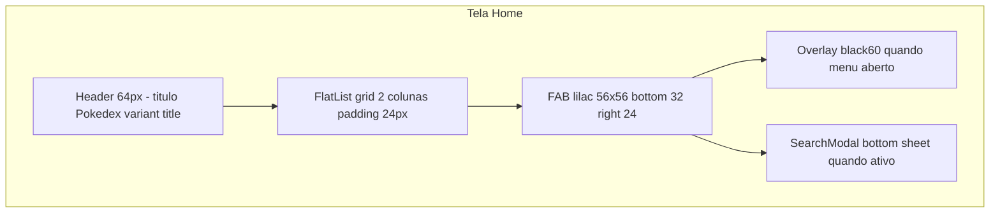
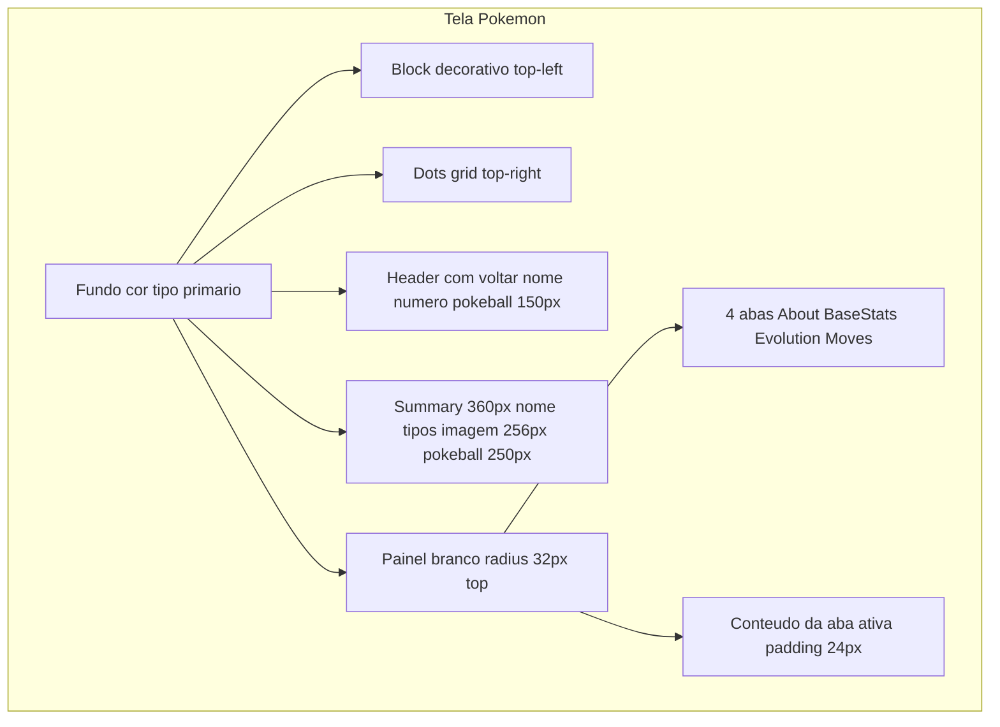

# Design System — Pokedex App (Migração Mobile)

Documento de referência visual extraído do app existente em `mobile/`. Destinado a um novo agente criar um projeto Expo/React Native com o **mesmo visual** do projeto atual.

**Inspiração original:** [Pokedex App design (Dribbble)](https://dribbble.com/shots/6563578-Pokedex-App-Animation) por Saepul Nahwan.

**Escopo deste documento:** tokens visuais, componentes, layouts de tela e regras de cor. **Fora do escopo:** animações, gestos e navegação.

---

## 1. Visão geral e princípios visuais

### Estética

- Cards coloridos com fundo baseado no **tipo primário** do Pokémon
- Tela de detalhe com fundo dinâmico (cor do tipo) e painel branco com cantos superiores arredondados
- Elementos decorativos: Pokeball semi-transparente, grid de dots, bloco rotacionado
- Tipografia Inter em pesos 400, 500 e 700
- Paleta neutra (cinzas) para textos secundários e inputs; acentos em lilac (`#6C79DB`) e blue (`#0055D4`)

### Configuração de referência do projeto atual

| Aspecto             | Valor                                                           |
| ------------------- | --------------------------------------------------------------- |
| Orientação          | Portrait                                                        |
| StatusBar (Home)    | `style="dark"`, `backgroundColor="#FFF"`, `translucent`         |
| StatusBar (Pokemon) | `style="light"`, `backgroundColor="transparent"`, `translucent` |
| Fonte               | Inter via `@expo-google-fonts/inter`                            |
| Estilização         | styled-components/native                                        |
| Stack de referência | Expo SDK 39, React Native 0.63                                  |

> O novo projeto pode usar qualquer stack (Expo SDK recente, StyleSheet, NativeWind, etc.). Este documento define **o que** reproduzir visualmente, não **como** implementar.

---

## 2. Tokens de design

### 2.1 Cores semânticas

| Token       | Hex       | Uso principal                             |
| ----------- | --------- | ----------------------------------------- |
| `black`     | `#272727` | Texto principal, ícones                   |
| `white`     | `#FFFFFF` | Fundos, texto sobre cards coloridos       |
| `grey`      | `#919191` | Texto secundário, labels de abas inativas |
| `lightGrey` | `#E7E7E8` | Bordas, fundo de barras de stat           |
| `semiGrey`  | `#F4F5F4` | Fundo de inputs, handle do modal          |
| `red`       | `#FA6555` | Stats abaixo de 50                        |
| `green`     | `#41D168` | Stats 50 ou acima                         |
| `blue`      | `#0055D4` | Indicador de aba ativa                    |
| `lilac`     | `#6C79DB` | FAB, botão de busca, ícones do menu       |

### 2.2 Paleta de tipos Pokémon

Usada como cor de fundo de cards e tela de detalhe (tipo primário), e em badges de effectiveness.

| Tipo     | Hex       |
| -------- | --------- |
| normal   | `#A8A878` |
| fighting | `#C03028` |
| flying   | `#A890F0` |
| poison   | `#A040A0` |
| ground   | `#E0C068` |
| rock     | `#B8A038` |
| bug      | `#A8B820` |
| ghost    | `#705898` |
| steel    | `#B8B8D0` |
| fire     | `#FA6C6C` |
| water    | `#6890F0` |
| grass    | `#48CFB2` |
| electric | `#FFCE4B` |
| psychic  | `#F85888` |
| ice      | `#98D8D8` |
| dragon   | `#7038F8` |
| dark     | `#705848` |
| fairy    | `#EE99AC` |

**Regra:** `getColorByPokemonType(type)` retorna a cor pelo nome do tipo em lowercase.

### 2.3 Aliases de cores hardcoded

Valores usados diretamente no código que equivalem a tokens existentes:

| Valor hardcoded | Equivalente                      |
| --------------- | -------------------------------- |
| `#F4F5F4`       | `semiGrey`                       |
| `#6890F0`       | `water` (ícone gênero masculino) |
| `#EE99AC`       | `fairy` (ícone gênero feminino)  |
| `#FFF`          | `white` (StatusBar Home)         |
| `#2867B2`       | Cor do adaptive icon Android     |

### 2.4 Padrão de opacidade (sufixo hex)

Em React Native, opacidade é aplicada concatenando sufixo hex à cor:

| Sufixo | Opacidade | Usos                                                       |
| ------ | --------- | ---------------------------------------------------------- |
| `20`   | ~12.5%    | Block, Dots, Pokeball default                              |
| `30`   | ~19%      | Badge de tipo, número Pokédex no card, effectiveness badge |
| `40`   | ~25%      | Sombra do FAB                                              |
| `60`   | ~37.5%    | Overlay do menu FAB                                        |
| `75`   | ~46%      | Placeholder do Input                                       |

**Exemplos:**

- `white20` → `${colors.white}20`
- `black30` → `${colors.black}30`
- `black60` → overlay do FAB
- `black75` → placeholder do input

### 2.5 Tipografia

**Família:** Inter (`@expo-google-fonts/inter`)

| Token fontFamily   | Peso |
| ------------------ | ---- |
| `Inter_400Regular` | 400  |
| `Inter_500Medium`  | 500  |
| `Inter_700Bold`    | 700  |

**Variantes de texto (`textVariantes`):**

| Variante  | fontSize | lineHeight | fontFamily    | Uso                                          |
| --------- | -------- | ---------- | ------------- | -------------------------------------------- |
| `title`   | 32px     | 44px       | Bold (700)    | Título "Pokedex", nome do Pokémon no summary |
| `body1`   | 18px     | 22px       | Medium (500)  | Títulos de seção, header compacto do Pokémon |
| `body2`   | 16px     | 22px       | Medium (500)  | Número Pokédex no summary                    |
| `body3`   | 14px     | 18px       | Medium (500)  | **Default** — texto geral                    |
| `input`   | 14px     | 18px       | Regular (400) | Campo de texto                               |
| `caption` | 12px     | 18px       | Medium (500)  | Badges de tipo, effectiveness                |

**Tamanhos ad hoc (fora do theme):**

| Tamanho | lineHeight | Contexto                     |
| ------- | ---------- | ---------------------------- |
| 10px    | —          | Número Pokédex no card       |
| 8px     | 10px       | Badge de tipo `size="small"` |

**Props do componente Text:**

- `variant` — chave de `textVariantes` (default: `body3`)
- `color` — chave de `theme.colors` (default: `black`)
- `bold` — força `fontFamily.bold`

### 2.6 Escala de espaçamento

Valores recorrentes (não formalizados no theme, mas usados consistentemente):

| Valor | Contextos                                                         |
| ----- | ----------------------------------------------------------------- |
| 4px   | Padding interno de badges small, effectiveness                    |
| 8px   | Margins entre elementos, gap de labels                            |
| 10px  | Margin de cards, posição do número no card                        |
| 12px  | Padding do menu FAB                                               |
| 16px  | Padding de cards, margins, ícone→input gap                        |
| 20px  | Padding horizontal do menu FAB                                    |
| 24px  | Padding horizontal padrão (header, input, modal, slides, summary) |
| 32px  | Margin vertical de seções, posição do FAB (bottom)                |
| 48px  | Altura de input e botão de busca                                  |
| 56px  | FAB (largura e altura)                                            |
| 64px  | `HEADER_HEIGHT`                                                   |
| 110px | Altura do card Pokémon                                            |
| 112px | Imagem na evolução                                                |
| 120px | Pokeball de fundo na evolução                                     |
| 150px | Pokeball no header do Pokémon                                     |
| 212px | Bloco decorativo (largura e altura)                               |
| 250px | Pokeball no summary                                               |
| 256px | Imagem do Pokémon no summary                                      |
| 360px | `POKEMON_SUMMARY_HEIGHT`                                          |

### 2.7 Border radius

| Valor | Uso                                                    |
| ----- | ------------------------------------------------------ |
| 12px  | Card Pokémon                                           |
| 16px  | Badges de tipo, effectiveness, ShadowContainer (About) |
| 22px  | Itens do menu FAB                                      |
| 24px  | Input, Block, botão de busca                           |
| 28px  | FAB (56px / 2)                                         |
| 32px  | Modal, painel de detalhes (top corners)                |
| 40px  | Handle do modal (80×4px)                               |

### 2.8 Sombras

| Elemento                | Valor                                                                      |
| ----------------------- | -------------------------------------------------------------------------- |
| PokemonCard             | `2px 4px 8px rgba(0, 0, 0, 0.15)`                                          |
| FAB                     | `0px 3px 6px rgba(39, 39, 39, 0.25)` — equivalente a `black` + sufixo `40` |
| ShadowContainer (About) | `0 6px 8px rgba(0, 0, 0, 0.1)`                                             |

### 2.9 Constantes de layout

```typescript
const HEADER_HEIGHT = 64;
const POKEMON_SUMMARY_HEIGHT = 360;
const TAB_BUTTON_WIDTH = (screenWidth - 48) / 4;
```

- **Details panel height:** `screenHeight - (statusBarHeight + HEADER_HEIGHT)`
- **Tabs padding horizontal:** 24px em cada lado (total 48px para cálculo da largura das abas)

### 2.10 Branding nativo

| Asset                            | Valor     |
| -------------------------------- | --------- |
| Splash background                | `#ffffff` |
| Android adaptive icon background | `#2867B2` |
| App name                         | Pokedex   |

---

## 3. Objeto de tema (referência TypeScript)

Copie e adapte para o novo projeto:

```typescript
export const theme = {
  colors: {
    black: "#272727",
    white: "#FFFFFF",
    grey: "#919191",
    lightGrey: "#E7E7E8",
    semiGrey: "#F4F5F4",
    red: "#FA6555",
    green: "#41D168",
    blue: "#0055D4",
    lilac: "#6C79DB",
  },
  fontFamily: {
    regular: "Inter_400Regular",
    medium: "Inter_500Medium",
    bold: "Inter_700Bold",
  },
  textVariantes: {
    title: { fontSize: 32, lineHeight: 44, fontFamily: "Inter_700Bold" },
    body1: { fontSize: 18, lineHeight: 22, fontFamily: "Inter_500Medium" },
    body2: { fontSize: 16, lineHeight: 22, fontFamily: "Inter_500Medium" },
    body3: { fontSize: 14, lineHeight: 18, fontFamily: "Inter_500Medium" },
    input: { fontSize: 14, lineHeight: 18, fontFamily: "Inter_400Regular" },
    caption: { fontSize: 12, lineHeight: 18, fontFamily: "Inter_500Medium" },
  },
} as const;

export const POKEMON_TYPE_COLORS = {
  normal: "#A8A878",
  fighting: "#C03028",
  flying: "#A890F0",
  poison: "#A040A0",
  ground: "#E0C068",
  rock: "#B8A038",
  bug: "#A8B820",
  ghost: "#705898",
  steel: "#B8B8D0",
  fire: "#FA6C6C",
  water: "#6890F0",
  grass: "#48CFB2",
  electric: "#FFCE4B",
  psychic: "#F85888",
  ice: "#98D8D8",
  dragon: "#7038F8",
  dark: "#705848",
  fairy: "#EE99AC",
} as const;

export const HEADER_HEIGHT = 64;
export const POKEMON_SUMMARY_HEIGHT = 360;
```

---

## 4. Biblioteca de componentes

### 4.1 Text

**Arquivos fonte:** `mobile/src/components/Text/`

| Prop      | Tipo                                                             | Default |
| --------- | ---------------------------------------------------------------- | ------- |
| `variant` | `title` \| `body1` \| `body2` \| `body3` \| `input` \| `caption` | `body3` |
| `color`   | chave de `theme.colors`                                          | `black` |
| `bold`    | `boolean`                                                        | `false` |

**Visual:** aplica variante tipográfica do theme; `bold` sobrescreve para `fontFamily.bold`.

---

### 4.2 Header

**Arquivos fonte:** `mobile/src/components/Header/`

| Prop       | Tipo        |
| ---------- | ----------- |
| `children` | `ReactNode` |

**Visual:**

- Wrapper: `SafeAreaView`
- Content: altura `64px`, padding horizontal `24px`
- Layout: `flex-direction: row`, `align-items: center`, `justify-content: space-between`

---

### 4.3 Input

**Arquivos fonte:** `mobile/src/components/Input/`

| Prop       | Tipo                      |
| ---------- | ------------------------- |
| `setValue` | `(value: string) => void` |
| `icon`     | nome do ícone Feather     |
| `...rest`  | `TextInputProps`          |

**Visual:**

- Container: altura `48px`, `flex: 1`, padding `0 24px`
- Background: `semiGrey`
- Border radius: `24px`
- Layout: row, ícone à esquerda (`margin-right: 16px`)
- Ícone: Feather, tamanho `24px`, cor `black`
- TextInput: variant `input`, cor `black`
- Placeholder: `black` + sufixo `75`

---

### 4.4 Modal

**Arquivos fonte:** `mobile/src/components/Modal/`

| Prop               | Tipo         |
| ------------------ | ------------ |
| `handleCloseModal` | `() => void` |
| `children`         | `ReactNode`  |

**Visual:**

- Posição: absoluta, bottom 0, largura total da tela
- Background: `white`
- Min-height: `200px`
- Border radius: `32px` (top-left, top-right)
- z-index: `10`
- Handle (Line): `80×4px`, radius `40px`, cor `semiGrey`, margin `16px 0`, centralizado
- Content: padding horizontal `24px`

---

### 4.5 Loading

**Arquivos fonte:** `mobile/src/components/Loading/`

| Prop    | Default                   |
| ------- | ------------------------- |
| `size`  | `'small'`                 |
| `color` | `'grey'` (chave do theme) |

**Visual:** wrapper fino sobre `ActivityIndicator` nativo.

---

### 4.6 Block

**Arquivos fonte:** `mobile/src/components/Block/`

**Visual:**

- Dimensões: `212×212px`
- Background: `white` + sufixo `20`
- Border radius: `24px`
- Posição: absoluta, `top: -95px`, `left: -110px`
- Transform: `rotate(-12deg)`
- Uso: elemento decorativo no canto superior esquerdo da tela Pokémon

---

### 4.7 Dots

**Arquivos fonte:** `mobile/src/components/Dots/`

**Visual:**

- Grid: `FlatList` com `numColumns={5}`, 15 dots (3 linhas × 5 colunas)
- Cada dot: `6×6px`, background `white` + sufixo `20`
- Spacing: `margin-left: 8px`, `margin-top: 10px`
- Posição container: absoluta, `top: statusBarHeight - 28`, `right: 30%`
- Uso: decoração no topo da tela Pokémon

---

### 4.8 Pokeball

**Arquivos fonte:** `mobile/src/components/Pokeball/`

| Prop         | Tipo        | Default     |
| ------------ | ----------- | ----------- |
| `width`      | `number`    | obrigatório |
| `height`     | `number`    | obrigatório |
| `color`      | `string`    | `white20`   |
| `withRotate` | `boolean`   | `false`     |
| `style`      | `ViewStyle` | `{}`        |

**Visual:**

- Asset: `mobile/assets/pokeball.png` (PNG com `tintColor`)
- z-index: `-1`
- Centralizado no container
- Dimensões variam por contexto (ver tabela abaixo)

| Contexto         | width × height | color                  |
| ---------------- | -------------- | ---------------------- |
| Card Pokémon     | 80 × 80        | default (`white20`)    |
| Header Pokémon   | 150 × 150      | default                |
| Summary Pokémon  | 250 × 250      | default                |
| Evolução (fundo) | 120 × 120      | `#F4F5F4` (`semiGrey`) |

---

### 4.9 PokemonTypes

**Arquivos fonte:** `mobile/src/components/PokemonTypes/`

| Prop      | Tipo                     |
| --------- | ------------------------ |
| `pokemon` | `Pokemon`                |
| `size`    | `'regular'` \| `'small'` |

**Variante `regular`:**

- Container: `flex-direction: row`, `align-items: center`
- Badge (Type): background `white30`, padding `6px 28px`, radius `16px`, `margin-right: 8px`
- Texto: variant `caption`, cor `white`

**Variante `small`:**

- Container: `flex-direction: column`, `align-items: flex-start`
- Badge: padding `4px 12px`, `margin-top: 4px`
- Texto: `8px` / line-height `10px`, cor `white`

---

## 5. Ícones

Biblioteca: `@expo/vector-icons`

| Família       | Ícone           | Tamanho | Cor       | Contexto               |
| ------------- | --------------- | ------- | --------- | ---------------------- |
| Feather       | `search`        | 24px    | `black`   | Input de busca         |
| Feather       | `list`          | 22px    | `white`   | FAB fechado            |
| Feather       | `x`             | 22px    | `white`   | FAB aberto             |
| Feather       | `search`        | 18px    | `lilac`   | Item do menu FAB       |
| Feather       | `arrow-left`    | 24px    | `white`   | Botão voltar (Pokemon) |
| Feather       | `arrow-right`   | 20px    | `grey`    | Seta entre evoluções   |
| MaterialIcons | `send`          | 20px    | `white`   | Botão enviar busca     |
| Foundation    | `male-symbol`   | 16px    | `#6890F0` | Gênero masculino       |
| Foundation    | `female-symbol` | 16px    | `#EE99AC` | Gênero feminino        |

---

## 6. Especificação visual por tela

### 6.1 Tela Home



**Estrutura:**

- Container: `flex: 1`, `position: relative`
- Header: título **"Pokedex"** com `Text variant="title"`
- Lista: `FlatList` 2 colunas, `margin-top: 8px`, `paddingHorizontal: 24`, `paddingBottom: 24`
- Estado inicial: `Loading` centralizado em tela cheia
- Footer da lista: `Loading` com `marginVertical: 8` durante paginação

#### PokemonCard

**Arquivos fonte:** `mobile/src/pages/Home/PokemonCard/`

| Prop             | Uso visual                                     |
| ---------------- | ---------------------------------------------- |
| `afterThirdCard` | Quando true: `margin-top: 0`, `margin-left: 0` |
| `rightCard`      | Quando true: `margin-right: 0`                 |

**Anatomia do card:**

```
┌─────────────────────────┐
│ Nome (white, bold)   #N │  ← número: absolute top-right 10px, black30, font 10px
│                         │
│ [tipos small]    [img]  │  ← imagem 72×72, absolute bottom-right 4px
│                  pokeball│  ← pokeball 80×80, absolute right -8 bottom -8
└─────────────────────────┘
```

| Propriedade    | Valor                                          |
| -------------- | ---------------------------------------------- |
| Altura         | 110px                                          |
| Margin         | 10px (ajustável por coluna)                    |
| Padding        | 16px                                           |
| Border radius  | 12px                                           |
| Background     | cor do tipo primário                           |
| Sombra         | `2px 4px 8px rgba(0,0,0,0.15)`                 |
| Imagem Pokémon | 72 × 72px                                      |
| Tipos          | `PokemonTypes size="small"`, `margin-top: 8px` |

#### FloatingButton (FAB)

**Arquivos fonte:** `mobile/src/pages/Home/FloatingButton/`

| Propriedade   | Valor                         |
| ------------- | ----------------------------- |
| Posição       | `bottom: 32px`, `right: 24px` |
| Tamanho       | 56 × 56px                     |
| Border radius | 28px                          |
| Background    | `lilac`                       |
| Sombra        | `0px 3px 6px black40`         |
| z-index       | 5                             |

**Menu (quando aberto):**

- Overlay: `black60`, fullscreen
- Container menu: `bottom: 48px`, `right: 0`, coluna reversa
- Item "Search": fundo `white`, padding `12px 20px`, radius `22px`, `margin-bottom: 16px`
- Texto do item: `body3` default + ícone `search` lilac 18px

#### SearchModal

**Arquivos fonte:** `mobile/src/pages/Home/SearchModal/`

- Compõe `Modal` + `Input` em row
- Placeholder: `"Search for a Pokémon name..."`
- Botão enviar: `48×48px`, radius `24px`, background `lilac`, `margin-left: 16px`
- Ícone `send` branco 20px ou `Loading` branco durante busca
- Visível apenas com input em foco

---

### 6.2 Tela Pokémon (Detalhe)



**Estrutura geral:**

- Container: `flex: 1`, background = cor do tipo primário
- Elementos decorativos: `Block` + `Dots` (posição absoluta)
- Camadas: Header → Summary (360px) → Details (painel branco)

#### Header Pokémon

**Arquivos fonte:** `mobile/src/pages/Pokemon/Header/`

- Estende `components/Header`
- Botão voltar: `40×40px`, ícone `arrow-left` branco 24px
- Nome: `body1`, `white`, `bold` (visível no header compacto)
- Número: `body3`, `white`, `bold`, formato `#123`
- Pokeball: 150×150, `withRotate`, posição `right: -32`

#### Summary

**Arquivos fonte:** `mobile/src/pages/Pokemon/Summary/`

| Propriedade        | Valor                                         |
| ------------------ | --------------------------------------------- |
| Altura container   | 360px (`POKEMON_SUMMARY_HEIGHT`)              |
| Padding horizontal | 24px                                          |
| Nome               | `title`, `white`                              |
| Número             | `body2`, `white`, `bold`                      |
| Tipos              | `PokemonTypes size="regular"`                 |
| Gênero (genera)    | `body3`, `white`                              |
| Imagem             | 256 × 256px, centralizada, `margin-top: 24px` |
| Pokeball fundo     | 250×250, centralizado no bottom               |

**Layout das rows:**

- Row 1: nome (esquerda) + número (direita), `space-between`
- Row 2: tipos (esquerda) + genera (direita), `margin-top: 16px`

#### Details (painel)

**Arquivos fonte:** `mobile/src/pages/Pokemon/Details/`

| Propriedade      | Valor                                   |
| ---------------- | --------------------------------------- |
| Background       | `white`                                 |
| Border radius    | 32px (top)                              |
| Altura           | `screenHeight - (statusBarHeight + 64)` |
| Padding vertical | 16px                                    |

**Tabs:**

| Propriedade     | Valor                                            |
| --------------- | ------------------------------------------------ |
| Abas            | About, Base Stats, Evolution, Moves              |
| Padding         | `16px 0 24px`, margin horizontal `24px`          |
| Borda inferior  | 1px `lightGrey`                                  |
| Largura por aba | `(screenWidth - 48) / 4`                         |
| Altura botão    | 24px                                             |
| Label ativa     | `black`, `bold`                                  |
| Label inativa   | `grey`, `bold`                                   |
| Indicador       | 2px altura, cor `blue`, largura = largura da aba |

**Slide content:** padding `24px`, largura = `screenWidth`

#### Aba About

**Arquivos fonte:** `mobile/src/pages/Pokemon/Details/About/`

| Elemento        | Estilo                                                                                                |
| --------------- | ----------------------------------------------------------------------------------------------------- |
| Section         | `margin-bottom: 32px`                                                                                 |
| SectionTitle    | `body1`, `bold`, `margin-bottom: 8px`                                                                 |
| SectionContent  | `margin-top: 16px`, row, `align-items: center`                                                        |
| SectionSubtitle | cor `grey`, largura fixa `100px`                                                                      |
| SectionText     | `bold`                                                                                                |
| ShadowContainer | fundo `white`, radius `16px`, sombra `0 6px 8px rgba(0,0,0,0.1)`, padding `24px`, row `space-between` |

**Conteúdo visual:**

- Descrição do Pokémon (texto corrido)
- Card Height/Weight lado a lado
- Seção Breeding: Gender (ícones Foundation), Egg Groups
- Seção Training: Base EXP

#### Aba Base Stats

**Arquivos fonte:** `mobile/src/pages/Pokemon/Details/BaseStats/`

| Elemento                  | Estilo                                                                  |
| ------------------------- | ----------------------------------------------------------------------- |
| Stat row                  | `margin-bottom: 16px`, row, `align-items: center`                       |
| Label                     | cor `grey`, largura `100px`                                             |
| Valor numérico            | `bold`, largura `30px`, `text-align: right`                             |
| StatLine (fundo)          | `flex: 1`, altura `3px`, cor `lightGrey`, `margin-left: 16px`           |
| StatValue (preenchimento) | altura `3px`, largura = `%` do stat, cor `red` se &lt; 50 senão `green` |

**Effectiveness (subseção):**

| Elemento         | Estilo                                                        |
| ---------------- | ------------------------------------------------------------- |
| Container        | `margin-top: 24px`                                            |
| Título           | `body1`, `bold` — "Type defenses"                             |
| Subtítulo        | cor `grey`, `margin-top: 8px`                                 |
| Lista            | row, `flex-wrap`                                              |
| Badge            | radius `16px`, padding `4px 20px`, `margin-bottom/right: 8px` |
| Badge background | cor do tipo + sufixo `30`                                     |
| Badge texto      | `caption`, `bold`, cor = cor do tipo                          |

#### Aba Evolution

**Arquivos fonte:** `mobile/src/pages/Pokemon/Details/Evolution/`

| Elemento         | Estilo                                                                                   |
| ---------------- | ---------------------------------------------------------------------------------------- |
| Título           | `body1`, `bold` — "Evolution Chain"                                                      |
| Content          | `margin-top: 32px`                                                                       |
| EvolutionSection | row, `space-between`, `align-items: center`                                              |
| Separador        | `hairlineWidth` border-bottom `lightGrey`, `padding-bottom: 32px`, `margin-bottom: 32px` |
| Pokémon (cada)   | centralizado, imagem 112×112, `margin-bottom: 16px`                                      |
| Pokeball fundo   | 120×120, cor `#F4F5F4`                                                                   |
| MinLevel         | centralizado, seta `arrow-right` grey 20px, texto `Lvl N` bold, `margin-top: 8px`        |
| Estado vazio     | texto `grey` — "No evolutions."                                                          |

#### Aba Moves

**Arquivos fonte:** `mobile/src/pages/Pokemon/Details/Moves/`

**Status:** não implementado visualmente. Apenas placeholder com texto "Moves" (Text nativo, sem estilos do design system).

---

## 7. Regras de cor dinâmica

1. **Fundo de card e tela de detalhe:** cor do **primeiro tipo** do Pokémon (`pokemon.types[0].name`)
2. **Badges de tipo:** fundo `white30` sobre fundo colorido; texto branco
3. **Barras de stats:** vermelho (`red`) se valor &lt; 50; verde (`green`) se ≥ 50; largura da barra = `%` do valor (max implícito 100)
4. **Effectiveness badges:** fundo = cor do tipo atacante + `30`; texto na cor sólida do tipo
5. **Número Pokédex no card:** `black30`, posição absoluta top-right

---

## 8. Assets e recursos visuais

### Assets locais esperados

| Arquivo           | Caminho                           | Uso                            |
| ----------------- | --------------------------------- | ------------------------------ |
| pokeball.png      | `mobile/assets/pokeball.png`      | Componente Pokeball (tintável) |
| icon.png          | `mobile/assets/icon.png`          | Ícone do app                   |
| splash.png        | `mobile/assets/splash.png`        | Splash screen                  |
| adaptive-icon.png | `mobile/assets/adaptive-icon.png` | Ícone adaptativo Android       |
| favicon.png       | `mobile/assets/favicon.png`       | Web                            |

> A pasta `assets/` pode não estar versionada no repositório. O asset `pokeball.png` é obrigatório para o visual correto.

### Imagens remotas (API)

| Contexto        | Dimensão exibida |
| --------------- | ---------------- |
| Card Pokémon    | 72 × 72px        |
| Summary Pokémon | 256 × 256px      |
| Evolução        | 112 × 112px      |

---

## 9. Mapa de arquivos fonte

### Tokens e tema

| Conteúdo                         | Arquivo                                     |
| -------------------------------- | ------------------------------------------- |
| Cores, fontes, tipografia        | `mobile/src/styles/theme.ts`                |
| Tipagem do theme                 | `mobile/src/styles/styled.d.ts`             |
| Cores Pokémon, constantes layout | `mobile/src/constants/index.ts`             |
| Helper cor por tipo              | `mobile/src/utils/getColorByPokemonType.ts` |
| Config nativa (splash, icon)     | `mobile/app.json`                           |
| Carregamento de fontes           | `mobile/App.tsx`                            |

### Componentes reutilizáveis

| Componente   | index.tsx                                      | styles.ts                                      |
| ------------ | ---------------------------------------------- | ---------------------------------------------- |
| Text         | `mobile/src/components/Text/index.tsx`         | `mobile/src/components/Text/styles.ts`         |
| Header       | `mobile/src/components/Header/index.tsx`       | `mobile/src/components/Header/styles.ts`       |
| Input        | `mobile/src/components/Input/index.tsx`        | `mobile/src/components/Input/styles.ts`        |
| Modal        | `mobile/src/components/Modal/index.tsx`        | `mobile/src/components/Modal/styles.ts`        |
| Loading      | `mobile/src/components/Loading/index.tsx`      | —                                              |
| Block        | `mobile/src/components/Block/index.tsx`        | `mobile/src/components/Block/styles.ts`        |
| Dots         | `mobile/src/components/Dots/index.tsx`         | `mobile/src/components/Dots/styles.ts`         |
| Pokeball     | `mobile/src/components/Pokeball/index.tsx`     | `mobile/src/components/Pokeball/styles.ts`     |
| PokemonTypes | `mobile/src/components/PokemonTypes/index.tsx` | `mobile/src/components/PokemonTypes/styles.ts` |

### Telas

| Tela / Seção        | Arquivos principais                                            |
| ------------------- | -------------------------------------------------------------- |
| Home                | `mobile/src/pages/Home/index.tsx`, `styles.ts`                 |
| PokemonCard         | `mobile/src/pages/Home/PokemonCard/`                           |
| FloatingButton      | `mobile/src/pages/Home/FloatingButton/`                        |
| Menu FAB            | `mobile/src/pages/Home/FloatingButton/Menu/`                   |
| SearchModal         | `mobile/src/pages/Home/SearchModal/`                           |
| Pokémon (container) | `mobile/src/pages/Pokemon/index.tsx`, `styles.ts`              |
| Header Pokémon      | `mobile/src/pages/Pokemon/Header/`                             |
| Summary             | `mobile/src/pages/Pokemon/Summary/`                            |
| Details + Tabs      | `mobile/src/pages/Pokemon/Details/`, `tabs.ts`                 |
| About               | `mobile/src/pages/Pokemon/Details/About/`                      |
| BaseStats           | `mobile/src/pages/Pokemon/Details/BaseStats/`                  |
| Effectiveness       | `mobile/src/pages/Pokemon/Details/BaseStats/Effectiveness/`    |
| Evolution           | `mobile/src/pages/Pokemon/Details/Evolution/`                  |
| EvolutionSection    | `mobile/src/pages/Pokemon/Details/Evolution/EvolutionSection/` |
| Moves               | `mobile/src/pages/Pokemon/Details/Moves/` (placeholder)        |

---

## 10. Checklist para o novo agente

Use esta lista para garantir paridade visual com o projeto de referência.

### Fase 1 — Fundação

- [ ] Configurar fonte Inter (400, 500, 700)
- [ ] Implementar objeto de tema com cores semânticas
- [ ] Implementar `POKEMON_TYPE_COLORS` e helper `getColorByPokemonType`
- [ ] Definir constantes `HEADER_HEIGHT` (64) e `POKEMON_SUMMARY_HEIGHT` (360)
- [ ] Configurar StatusBar: dark/white na Home, light/transparent na tela Pokémon
- [ ] Adicionar asset `pokeball.png` tintável

### Fase 2 — Componentes base

- [ ] `Text` com 6 variantes + props `color` e `bold`
- [ ] `Header` (64px, padding 24px)
- [ ] `Input` (48px, semiGrey, radius 24px, ícone Feather)
- [ ] `Modal` (bottom sheet, radius 32px top, handle 80×4)
- [ ] `Loading` (ActivityIndicator, default grey/small)
- [ ] `Block` (212×212, white20, rotate -12°)
- [ ] `Dots` (grid 5×15, dots 6×6 white20)
- [ ] `Pokeball` (PNG tintável, dimensões configuráveis)
- [ ] `PokemonTypes` (variantes regular e small)

### Fase 3 — Tela Home

- [ ] Header com título "Pokedex" (title)
- [ ] Grid 2 colunas com PokemonCard
- [ ] Card: 110px, cor do tipo, sombra, imagem 72×72, tipos small, pokeball 80×80
- [ ] FAB lilac 56×56 com menu e overlay black60
- [ ] SearchModal com Input + botão lilac 48×48

### Fase 4 — Tela Pokémon

- [ ] Fundo cor do tipo primário
- [ ] Block + Dots decorativos
- [ ] Header: voltar 40×40, nome/número compacto, pokeball 150×150
- [ ] Summary 360px: nome title, tipos regular, imagem 256×256, pokeball 250×250
- [ ] Painel Details branco, radius 32px top
- [ ] 4 tabs com indicador blue 2px
- [ ] About: sections, ShadowContainer com sombra
- [ ] BaseStats: barras 3px, threshold 50 red/green, effectiveness badges
- [ ] Evolution: row com imagens 112×112, pokeball fundo semiGrey
- [ ] Moves: placeholder (opcional — não há design definido)

### Fase 5 — Validação visual

- [ ] Comparar cores com tabelas deste documento
- [ ] Verificar border-radius em cards (12), inputs (24), modal (32)
- [ ] Confirmar opacidades (white20, white30, black30, black60, black75)
- [ ] Testar com Pokémon de tipos diferentes (fire, water, grass, etc.)
- [ ] Verificar ícones e tamanhos conforme seção 5

---

## 11. Notas para implementação

1. **Opacidade hex:** em React Native Web/CSS use `rgba()` equivalente; em RN nativo o sufixo hex funciona em cores de 6 dígitos.
2. **Sombras:** no Android, pode ser necessário `elevation` além de `box-shadow` para paridade visual.
3. **Safe area:** o Header usa `SafeAreaView` — respeitar notch e status bar no novo projeto.
4. **Moves:** a aba existe na UI mas não tem design; pode ser omitida ou receber design novo.
5. **Projeto de referência:** monorepo com app em `mobile/` (Expo SDK 39). O novo projeto provavelmente usará SDK mais recente — adapte APIs deprecadas mantendo o visual.
